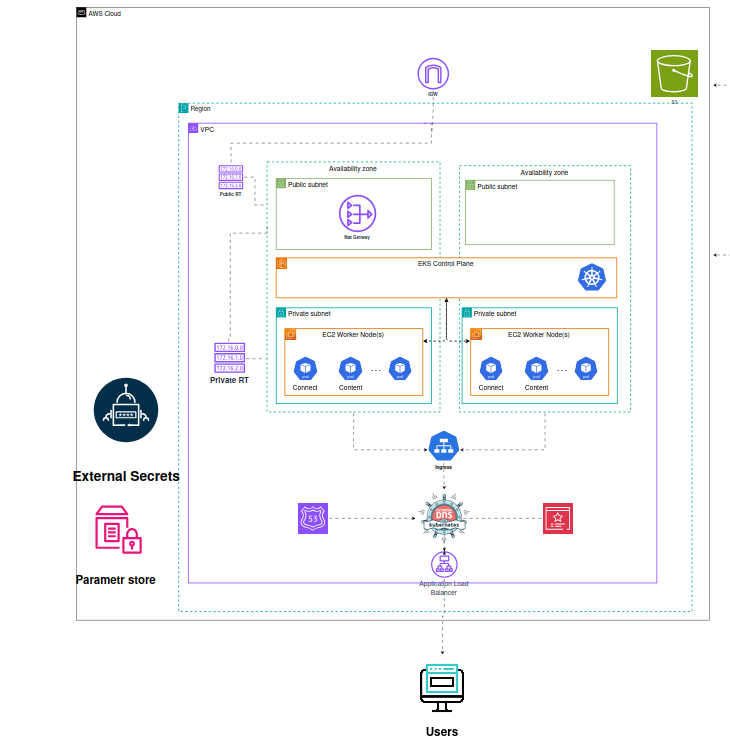
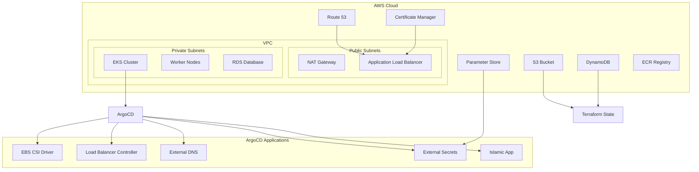
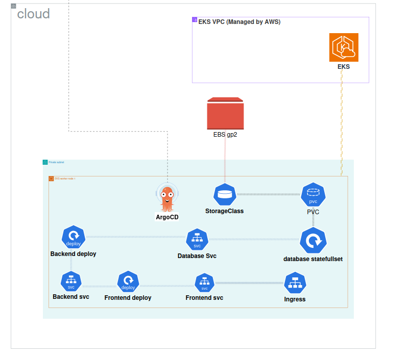
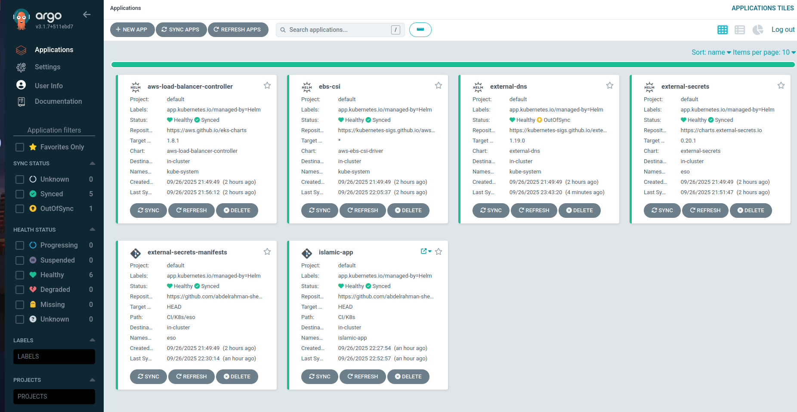

# Islamic App - Continuous Deployment (CD) Infrastructure

## Overview

This repository contains the complete Infrastructure as Code (IaC) implementation for the Islamic App using Terraform and ArgoCD. The CD pipeline provisions a production-ready EKS cluster from scratch with all necessary AWS resources and implements GitOps-based application deployment.

## 🏗️ Infrastructure Architecture

<!-- TODO: Add Complete Infrastructure Architecture Diagram -->





### Core Infrastructure

#### **VPC & Networking**
- **Custom VPC**: Complete network isolation with public/private subnets
- **NAT Gateway**: Secure outbound internet access for private resources
- **Internet Gateway**: Public internet access for load balancers
- **Security Groups**: Granular network security controls
- **Route Tables**: Optimized routing for different subnet tiers


#### **EKS Cluster Configuration**
```hcl
resource "aws_eks_cluster" "eks" {
  name = "eks-cluster"
  version  = "1.31"
  role_arn = aws_iam_role.eks_role.arn
    vpc_config {
        endpoint_private_access = false 
        endpoint_public_access = true
    subnet_ids = [
      aws_subnet.private1.id,
      aws_subnet.private2.id,
      aws_subnet.public1.id
    ]
    security_group_ids = [aws_security_group.eks_control_plane.id]
  }
  
  access_config {
    authentication_mode = "API"
    bootstrap_cluster_creator_admin_permissions = true
    
  }

  depends_on = [ aws_iam_role_policy_attachment.eks-attach1, aws_iam_role_policy_attachment.eks-attach2]
}

```

#### **Worker Nodes**
- **Custom Node Groups**: Tailored compute resources for different workloads
- **Auto Scaling**: Dynamic scaling based on cluster demand
- **Instance Types**: Optimized instance selection for cost and performance
- **Spot Instances**: Cost optimization with spot instance integration

### State Management

#### **Remote State Storage**
```hcl
terraform {
  backend "s3" {
    bucket = "shebl22-terraform-state"
    key    = "global/s3/terraform.tfstate"
    dynamodb_table = "terraform-state"
    region = "us-east-1"
  }
}

```

#### **State Locking**
- **DynamoDB Table**: Prevents concurrent state modifications
- **Encryption**: State files encrypted at rest in S3
- **Versioning**: S3 versioning for state file history
- **Access Control**: IAM policies for secure state access


### DNS & SSL Management

#### **Route 53 Configuration**
- **Hosted Zone**: Manages DNS records for `shebl22.me` domain
- **Subdomain Routing**: Automated DNS record creation for services
- **Health Checks**: DNS-level health monitoring
- **Alias Records**: Optimized routing to AWS load balancers

#### **Certificate Manager**
- **Wildcard Certificates**: `*.shebl22.me` SSL certificate
- **Automatic Renewal**: AWS-managed certificate renewal
- **Multi-Region Support**: Certificate replication across regions
- **Integration**: Seamless integration with load balancers and ingresses

### Secrets Management

#### **AWS Parameter Store**

## 🔄 ArgoCD Application Deployment

### GitOps Workflow Diagram

<!-- TODO: Add GitOps Workflow Diagram -->


The deployment follows a GitOps approach where ArgoCD continuously monitors the Git repository and automatically applies changes to the Kubernetes cluster.

### ArgoCD Applications Stack

<!-- TODO: Add ArgoCD Dashboard Screenshot -->


#### **1. EBS CSI Driver** (Sync Wave: -1)
- **Purpose**: Enables EBS volume provisioning for persistent storage
- **IRSA Integration**: Uses IAM roles for service accounts
- **Storage Classes**: Provides dynamic volume provisioning

#### **2. AWS Load Balancer Controller** (Sync Wave: 0)
- **Purpose**: Manages AWS Application Load Balancers for Kubernetes services
- **Integration**: Direct integration with AWS VPC and subnets
- **SSL Termination**: Handles SSL/TLS termination at load balancer level

#### **3. External DNS** (Sync Wave: 2)
- **Purpose**: Automatically creates Route 53 DNS records for ingresses
- **Domain Management**: Manages `shebl22.me` domain records
- **Service Discovery**: Enables custom domain routing to services

#### **4. External Secrets Operator** (Sync Wave: 3)
- **Purpose**: Syncs secrets from AWS Parameter Store to Kubernetes
- **Security**: Secure secret injection into application pods
- **Rotation**: Supports automatic secret rotation

#### **5. External Secrets Manifests** (Sync Wave: 4)
- **SecretStore Configuration**: Connects to AWS Parameter Store
- **ExternalSecret Resources**: Defines which secrets to sync
- **Target Secrets**: Creates Kubernetes secrets for applications

#### **6. Islamic App** (Sync Wave: 5)
- **Purpose**: Deploys the main three-tier application
- **Components**: Frontend, backend, and database deployments
- **Configuration**: Uses ConfigMaps and Secrets for configuration

#### **7. Ingress Configuration** (Sync Wave: 6)
- **Purpose**: Configures ingress with SSL certificate
- **SSL Integration**: Uses Certificate Manager ARN from Terraform
- **Load Balancing**: Routes traffic to appropriate services

## 🔧 Deployment Process

### Prerequisites

1. **AWS Credentials**: Configured with appropriate permissions
2. **Terraform**: Version 1.5+ installed
3. **kubectl**: Kubernetes CLI tool
4. **Helm**: Helm 3.x for chart deployments

## 🤝 Contributing

1. Fork the repository
2. Create an infrastructure branch
3. Make your changes
4. Test in development environment
5. Submit a pull request with detailed changes

## 📄 License

This project is licensed under the MIT License - see the [LICENSE](LICENSE) file for details.