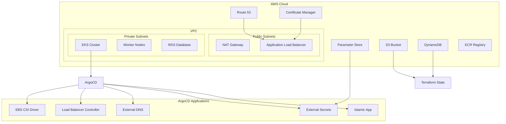

# Islamic App - Continuous Deployment (CD) Infrastructure

## Overview

This repository contains the complete Infrastructure as Code (IaC) implementation for the Islamic App using Terraform and ArgoCD. The CD pipeline provisions a production-ready EKS cluster from scratch with all necessary AWS resources and implements GitOps-based application deployment.

## 🏗️ Infrastructure Architecture

<!-- TODO: Add Complete Infrastructure Architecture Diagram -->




## 🚀 Terraform Infrastructure Components

### Terraform Directory Structure

<!-- TODO: Add Terraform Directory Structure Diagram -->


### Core Infrastructure

#### **VPC & Networking**
- **Custom VPC**: Complete network isolation with public/private subnets
- **NAT Gateway**: Secure outbound internet access for private resources
- **Internet Gateway**: Public internet access for load balancers
- **Security Groups**: Granular network security controls
- **Route Tables**: Optimized routing for different subnet tiers

<!-- TODO: Add VPC Architecture Screenshot -->


#### **EKS Cluster Configuration**
```hcl
# Custom EKS cluster (not using modules)
resource "aws_eks_cluster" "islamic_app" {
  name     = var.cluster_name
  role_arn = aws_iam_role.eks_cluster_role.arn
  version  = var.kubernetes_version
  
  vpc_config {
    subnet_ids              = concat(var.private_subnet_ids, var.public_subnet_ids)
    endpoint_private_access = true
    endpoint_public_access  = true
    public_access_cidrs     = var.public_access_cidrs
  }
  
  encryption_config {
    provider {
      key_arn = aws_kms_key.eks.arn
    }
    resources = ["secrets"]
  }
}
```

<!-- TODO: Add EKS Cluster Console Screenshot -->


#### **Worker Nodes**
- **Custom Node Groups**: Tailored compute resources for different workloads
- **Auto Scaling**: Dynamic scaling based on cluster demand
- **Instance Types**: Optimized instance selection for cost and performance
- **Spot Instances**: Cost optimization with spot instance integration

<!-- TODO: Add Worker Nodes Screenshot -->


### State Management

#### **Remote State Storage**
```hcl
terraform {
  backend "s3" {
    bucket         = "islamic-app-terraform-state"
    key            = "eks/terraform.tfstate"
    region         = "us-west-2"
    dynamodb_table = "terraform-state-lock"
    encrypt        = true
  }
}
```

<!-- TODO: Add S3 State Bucket Screenshot -->


#### **State Locking**
- **DynamoDB Table**: Prevents concurrent state modifications
- **Encryption**: State files encrypted at rest in S3
- **Versioning**: S3 versioning for state file history
- **Access Control**: IAM policies for secure state access

<!-- TODO: Add DynamoDB Lock Table Screenshot -->


### DNS & SSL Management

#### **Route 53 Configuration**
- **Hosted Zone**: Manages DNS records for `shebl22.me` domain
- **Subdomain Routing**: Automated DNS record creation for services
- **Health Checks**: DNS-level health monitoring
- **Alias Records**: Optimized routing to AWS load balancers

<!-- TODO: Add Route 53 Console Screenshot -->


#### **Certificate Manager**
- **Wildcard Certificates**: `*.shebl22.me` SSL certificate
- **Automatic Renewal**: AWS-managed certificate renewal
- **Multi-Region Support**: Certificate replication across regions
- **Integration**: Seamless integration with load balancers and ingresses

<!-- TODO: Add Certificate Manager Screenshot -->


### Secrets Management

#### **AWS Parameter Store**
```hcl
resource "aws_ssm_parameter" "database_password" {
  name  = "/islamic-app/database/password"
  type  = "SecureString"
  value = var.database_password
  
  tags = {
    Environment = var.environment
    Application = "islamic-app"
  }
}
```

<!-- TODO: Add Parameter Store Screenshot -->


## 🔄 ArgoCD Application Deployment

### GitOps Workflow Diagram

<!-- TODO: Add GitOps Workflow Diagram -->


The deployment follows a GitOps approach where ArgoCD continuously monitors the Git repository and automatically applies changes to the Kubernetes cluster.

### ArgoCD Applications Stack

<!-- TODO: Add ArgoCD Dashboard Screenshot -->


#### **1. EBS CSI Driver** (Sync Wave: -1)
```yaml
ebs-csi:
  source:
    chart: aws-ebs-csi-driver
    repoURL: https://kubernetes-sigs.github.io/aws-ebs-csi-driver
  serviceAccount:
    annotations:
      eks.amazonaws.com/role-arn: ${ebs_role_arn}
```
- **Purpose**: Enables EBS volume provisioning for persistent storage
- **IRSA Integration**: Uses IAM roles for service accounts
- **Storage Classes**: Provides dynamic volume provisioning

#### **2. AWS Load Balancer Controller** (Sync Wave: 0)
```yaml
aws-load-balancer-controller:
  source:
    chart: aws-load-balancer-controller
    repoURL: https://aws.github.io/eks-charts
    targetRevision: 1.8.1
  helm:
    parameters:
      - name: clusterName
        value: ${cluster_name}
```
- **Purpose**: Manages AWS Application Load Balancers for Kubernetes services
- **Integration**: Direct integration with AWS VPC and subnets
- **SSL Termination**: Handles SSL/TLS termination at load balancer level

<!-- TODO: Add Load Balancer Controller Screenshot -->


#### **3. External DNS** (Sync Wave: 2)
```yaml
external-dns:
  helm:
    values: |
      provider: aws
      domainFilters:
        - shebl22.me
      sources:
        - service
        - ingress
      policy: sync
      txtOwnerId: ${cluster_name}
```
- **Purpose**: Automatically creates Route 53 DNS records for ingresses
- **Domain Management**: Manages `shebl22.me` domain records
- **Service Discovery**: Enables custom domain routing to services

#### **4. External Secrets Operator** (Sync Wave: 3)
```yaml
external-secrets:
  source:
    chart: external-secrets
    repoURL: https://charts.external-secrets.io
    targetRevision: 0.20.1
  serviceAccount:
    annotations:
      eks.amazonaws.com/role-arn: ${eso_role_arn}
```
- **Purpose**: Syncs secrets from AWS Parameter Store to Kubernetes
- **Security**: Secure secret injection into application pods
- **Rotation**: Supports automatic secret rotation

<!-- TODO: Add External Secrets Operator Screenshot -->


#### **5. External Secrets Manifests** (Sync Wave: 4)
- **SecretStore Configuration**: Connects to AWS Parameter Store
- **ExternalSecret Resources**: Defines which secrets to sync
- **Target Secrets**: Creates Kubernetes secrets for applications

#### **6. Islamic App** (Sync Wave: 5)
```yaml
islamic-app:
  source:
    path: CI/K8s
    repoURL: https://github.com/abdelrahman-shebl/Islamic-app.git
    targetRevision: HEAD
```
- **Purpose**: Deploys the main three-tier application
- **Components**: Frontend, backend, and database deployments
- **Configuration**: Uses ConfigMaps and Secrets for configuration

<!-- TODO: Add Application Deployment Screenshot -->


#### **7. Ingress Configuration** (Sync Wave: 6)
```yaml
ingress-app:
  source:
    path: CI/K8s/ingress
  helm:
    values: |
      sslCertificateArn: ${sslCertificateArn}
```
- **Purpose**: Configures ingress with SSL certificate
- **SSL Integration**: Uses Certificate Manager ARN from Terraform
- **Load Balancing**: Routes traffic to appropriate services

## 🔐 Security & IAM Configuration

### IRSA (IAM Roles for Service Accounts) Architecture

<!-- TODO: Add IRSA Architecture Diagram -->


#### **EBS CSI Driver Role**
```hcl
resource "aws_iam_role" "ebs_csi_role" {
  name = "EKS-EBS-CSI-DriverRole-${var.cluster_name}"
  
  assume_role_policy = jsonencode({
    Version = "2012-10-17"
    Statement = [{
      Effect = "Allow"
      Principal = {
        Federated = aws_iam_openid_connect_provider.eks.arn
      }
      Action = "sts:AssumeRoleWithWebIdentity"
    }]
  })
}
```

#### **External DNS Role**
- **Route 53 Permissions**: Manage DNS records in hosted zones
- **Limited Scope**: Only access to specified domain zones
- **Cross-Account Support**: Can manage DNS across multiple AWS accounts

#### **External Secrets Role**
- **Parameter Store Access**: Read access to application secrets
- **KMS Permissions**: Decrypt encrypted parameters
- **Resource-Based Policies**: Fine-grained access control

<!-- TODO: Add IAM Roles Screenshot -->


### Network Security

#### **Security Groups**
- **EKS Cluster**: Control plane network access
- **Node Groups**: Worker node communication rules
- **Load Balancer**: Ingress traffic filtering
- **RDS**: Database access restrictions

<!-- TODO: Add Security Groups Screenshot -->


#### **Network ACLs**
- **Subnet-Level Security**: Additional network filtering
- **Defense in Depth**: Multiple security layers
- **Traffic Logging**: VPC Flow Logs for monitoring

## 🔧 Deployment Process

### Prerequisites

1. **AWS Credentials**: Configured with appropriate permissions
2. **Terraform**: Version 1.5+ installed
3. **kubectl**: Kubernetes CLI tool
4. **Helm**: Helm 3.x for chart deployments

### Infrastructure Deployment

#### **1. Initialize Terraform**
```bash
cd terraform/
terraform init
```

<!-- TODO: Add Terraform Init Screenshot -->


#### **2. Plan Infrastructure**
```bash
terraform plan -var-file="environments/prod.tfvars"
```

<!-- TODO: Add Terraform Plan Screenshot -->


#### **3. Apply Infrastructure**
```bash
terraform apply -var-file="environments/prod.tfvars"
```

<!-- TODO: Add Terraform Apply Screenshot -->


#### **4. Configure kubectl**
```bash
aws eks update-kubeconfig --region us-west-2 --name islamic-app-cluster
```

#### **5. Install ArgoCD**
```bash
kubectl create namespace argocd
kubectl apply -n argocd -f https://raw.githubusercontent.com/argoproj/argo-cd/stable/manifests/install.yaml
```

#### **6. Deploy ArgoCD Applications**
```bash
kubectl apply -f argocd-apps/
```

<!-- TODO: Add ArgoCD Applications Sync Screenshot -->


### Environment Configuration

#### **Production Variables**
```hcl
# environments/prod.tfvars
cluster_name = "islamic-app-prod"
environment  = "production"
vpc_cidr     = "10.0.0.0/16"

worker_nodes = {
  desired_size = 3
  max_size     = 10
  min_size     = 1
  instance_types = ["t3.medium", "t3.large"]
}
```

#### **Development Variables**
```hcl
# environments/dev.tfvars
cluster_name = "islamic-app-dev"
environment  = "development"
vpc_cidr     = "10.1.0.0/16"

worker_nodes = {
  desired_size = 1
  max_size     = 3
  min_size     = 1
  instance_types = ["t3.small"]
}
```

## 📊 Monitoring & Observability

<!-- TODO: Add Monitoring Dashboard Screenshot -->


### Infrastructure Monitoring
- **CloudWatch**: AWS native monitoring and logging
- **VPC Flow Logs**: Network traffic analysis
- **EKS Control Plane Logs**: Kubernetes API server logs
- **Cost Explorer**: Infrastructure cost tracking

<!-- TODO: Add CloudWatch Dashboard Screenshot -->


### Application Monitoring
- **ArgoCD Dashboard**: GitOps deployment status
- **Kubernetes Dashboard**: Cluster resource monitoring
- **Prometheus/Grafana**: Application metrics (via external secrets)

## 🔄 Backup & Disaster Recovery

### State File Backup
- **S3 Cross-Region Replication**: Automated state file backup
- **Point-in-Time Recovery**: S3 versioning for state rollback
- **Disaster Recovery**: Multi-region deployment capability

### Application Backup
- **EBS Snapshots**: Automated database backups
- **GitOps Recovery**: Application state stored in Git
- **Cluster Backup**: EKS cluster configuration backup

<!-- TODO: Add Backup Configuration Screenshot -->


## 🚀 Scaling & Performance

### Horizontal Scaling
- **Cluster Autoscaler**: Automatic node scaling
- **HPA**: Horizontal Pod Autoscaler for applications
- **Load Balancer**: Multi-AZ load distribution

<!-- TODO: Add Cluster Autoscaler Screenshot -->


### Vertical Scaling
- **VPA**: Vertical Pod Autoscaler for resource optimization
- **Instance Sizing**: Right-sizing recommendations
- **Storage Scaling**: Dynamic EBS volume expansion

## 📚 Best Practices

### Infrastructure as Code
- **Module Organization**: Reusable Terraform modules
- **State Management**: Secure and reliable state storage
- **Version Control**: All infrastructure changes tracked in Git

### Security Best Practices
- **Least Privilege**: Minimal required permissions
- **Network Segmentation**: Isolated network tiers
- **Encryption**: Data encrypted in transit and at rest
- **Regular Updates**: Automated security patching

### Cost Optimization
- **Spot Instances**: Cost-effective compute resources
- **Right Sizing**: Optimal resource allocation
- **Reserved Capacity**: Long-term cost savings
- **Monitoring**: Continuous cost tracking and optimization

<!-- TODO: Add Cost Dashboard Screenshot -->


## 🤝 Contributing

1. Fork the repository
2. Create an infrastructure branch
3. Make your changes
4. Test in development environment
5. Submit a pull request with detailed changes

## 📖 Documentation

- [Terraform Modules](./docs/terraform-modules.md)
- [ArgoCD Configuration](./docs/argocd-setup.md)
- [Security Guidelines](./docs/security.md)
- [Troubleshooting Guide](./docs/troubleshooting.md)
- [Cost Optimization](./docs/cost-optimization.md)

## 📄 License

This project is licensed under the MIT License - see the [LICENSE](LICENSE) file for details.