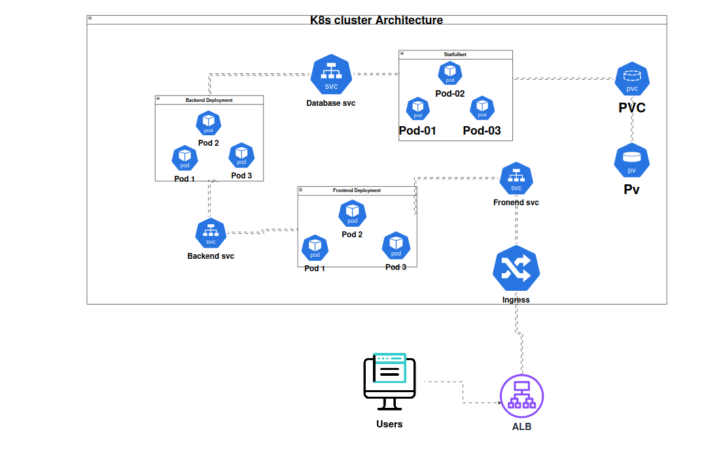

# Islamic App - Continuous Integration (CI) Pipeline

## Overview

This repository implements a comprehensive CI/CD pipeline for the Islamic App, a three-tier web application. The CI pipeline is built using GitHub Actions and focuses on automated testing, security scanning, containerization, and Kubernetes manifest updates.

## 🏗️ Architecture

The Islamic App follows a three-tier architecture:

- **Frontend**: React.js application serving the user interface
- **Backend**: API service handling business logic and data processing  
- **Database**: Persistent data storage with StatefulSets for high availability

## 🔄 CI Pipeline Workflow

### Architecture Diagram
<!-- TODO: Add CI Pipeline Architecture Diagram -->


### GitHub Actions Pipeline

The CI pipeline automatically triggers on code changes and performs the following steps:


### Pipeline Stages

#### 1. **Automated Testing**
- Runs comprehensive unit and integration tests
- Validates application functionality before deployment
- Ensures code quality and reliability


#### 2. **Docker Build**
- Builds containerized images for frontend and backend services
- Optimizes images for production deployment
- Tags images with commit SHA and latest

#### 3. **Security Scanning with Trivy**
- Performs vulnerability assessment on container images
- Scans for known CVEs in base images and dependencies
- Blocks deployment of images with critical vulnerabilities


#### 4. **Docker Registry Push**
- Pushes validated and scanned images to container registry
- Maintains image versioning for rollback capabilities

#### 5. **Kubernetes Manifest Updates**
- Automatically updates K8s deployment manifests with new image tags
- Commits changes back to repository for GitOps workflow
- Triggers ArgoCD sync for deployment

## 📁 Kubernetes Structure

<!-- TODO: Add Kubernetes Dashboard Screenshot -->


```
CI/K8s/
├── config-maps/          # Configuration data for applications
│   ├── cm-back.yaml      # Backend configuration
│   ├── cm-front.yaml     # Frontend configuration
│   └── db-cm.yaml        # Database configuration
├── Deployments/          # Application deployments
│   ├── backend-deploy.yaml
│   └── frontend-deploy.yaml
├── eso/                  # External Secrets Operator configs
│   ├── aws-secretstore.yaml
│   ├── backend-external-secret.yaml
│   ├── db-external-secret.yaml
│   └── prom-external-secrets.yaml
├── ingress/              # Helm chart for ingress configuration
│   ├── Chart.yaml
│   ├── templates/
│   │   └── ingress.yaml
│   └── values.yaml
├── secrets/              # Secret configurations
│   ├── back-creds.yaml
│   └── db-creds.yaml
├── services/             # Service definitions
│   ├── back-svc.yaml
│   ├── db-svc.yaml
│   └── front-svc.yaml
├── statefulsets/         # StatefulSet for database
│   └── db-ss.yaml
├── StorageClass/         # EBS storage configuration
│   └── ebs-storage.yaml
└── kustomization.yaml    # Kustomize configuration
```

## 🔐 Security Features

### External Secrets Integration
- **AWS Parameter Store**: Securely stores application secrets
- **External Secrets Operator**: Fetches secrets from AWS Parameter Store
- **Secret Rotation**: Automatic secret rotation capabilities

### Container Security
- **Trivy Scanning**: Comprehensive vulnerability assessment
- **Image Signing**: Container image integrity verification
- **Security Policies**: Enforced security standards for deployments

## 🗄️ Storage Configuration

### EBS Volumes
- **Persistent Storage**: EBS volumes for database persistence
- **Storage Classes**: Optimized storage classes for different workloads
- **Backup Strategy**: Automated backup and recovery procedures

### StatefulSets
- **Database Persistence**: Ensures data consistency and availability
- **Ordered Deployment**: Maintains proper startup sequence
- **Stable Network Identity**: Consistent pod naming and networking

## 🌐 Ingress & Networking

### Helm Chart Configuration
- **Dynamic SSL Certificates**: Terraform-managed certificate ARN injection
- **Load Balancer Integration**: AWS Load Balancer Controller integration
- **Custom Domain**: External-DNS integration for custom domain routing

### SSL/TLS Security
- **Certificate Manager**: AWS Certificate Manager integration
- **HTTPS Enforcement**: Automatic HTTP to HTTPS redirection
- **Certificate Rotation**: Automated certificate renewal


## 📋 Monitoring & Observability

### Pipeline Monitoring
- **GitHub Actions Dashboard**: Real-time pipeline status
- **Slack/Email Notifications**: Alert system for pipeline failures
- **Metrics Collection**: Build time and success rate tracking

### Application Monitoring
- **Prometheus Integration**: Metrics collection from applications
- **External Secrets for Monitoring**: Secure credential management
- **Health Checks**: Automated application health monitoring

## 🔧 Customization

### Environment Configuration
- **ConfigMaps**: Environment-specific configurations
- **Secrets Management**: Secure handling of sensitive data
- **Feature Flags**: Dynamic feature toggling capabilities

### Scaling Configuration
- **Horizontal Pod Autoscaling**: Automatic scaling based on metrics
- **Vertical Pod Autoscaling**: Resource optimization
- **Cluster Autoscaling**: Node scaling based on demand

## 📚 Best Practices

### Code Quality
- **Automated Testing**: Comprehensive test coverage
- **Code Linting**: Automated code quality checks
- **Security Scanning**: Regular vulnerability assessments

### GitOps Workflow
- **Infrastructure as Code**: All configurations in version control
- **Automated Deployments**: GitOps-driven deployment strategy
- **Rollback Capabilities**: Easy rollback to previous versions

## 🤝 Contributing

1. Fork the repository
2. Create a feature branch
3. Make your changes
4. Run tests locally
5. Submit a pull request

## 📄 License

This project is licensed under the MIT License - see the [LICENSE](LICENSE) file for details.