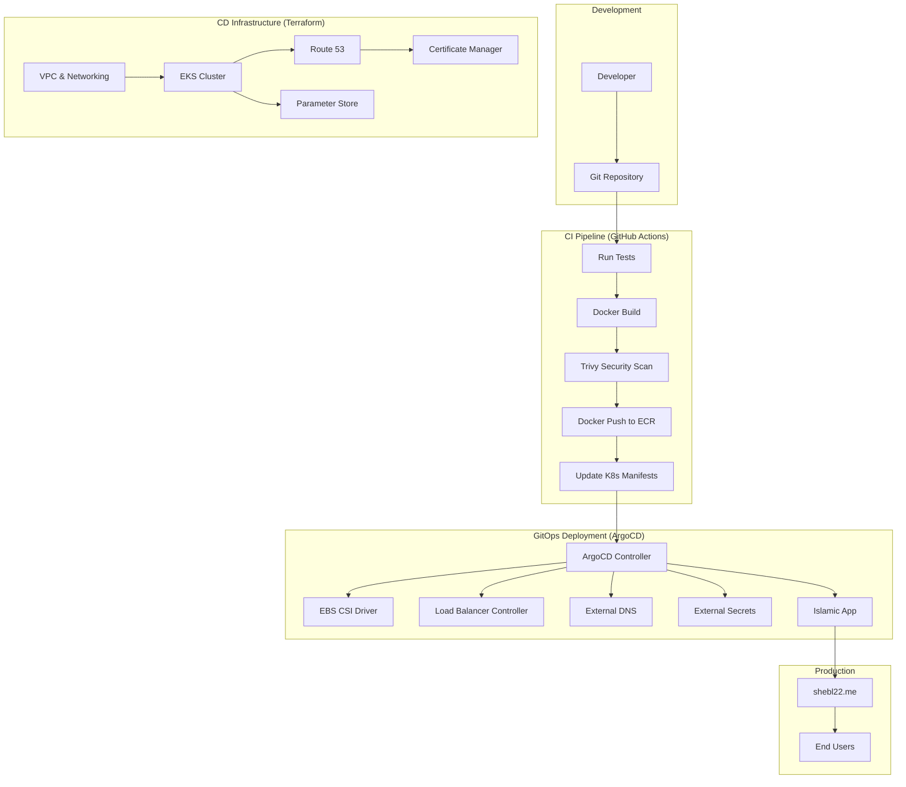
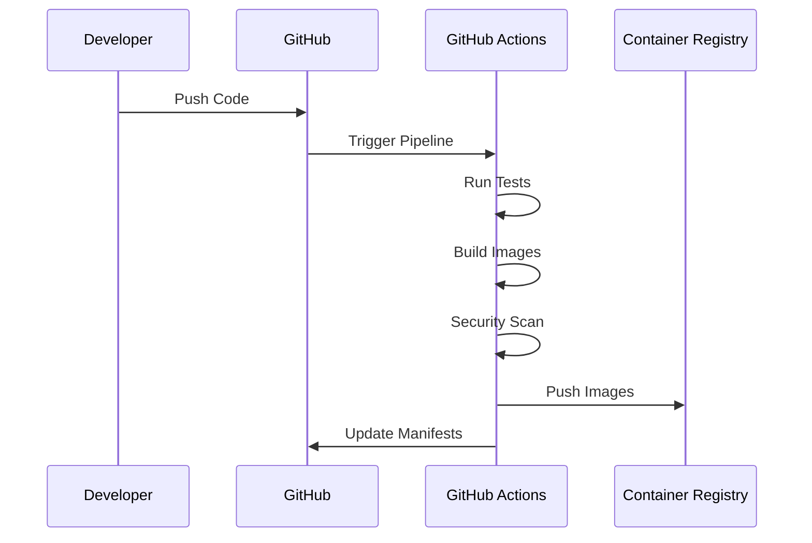
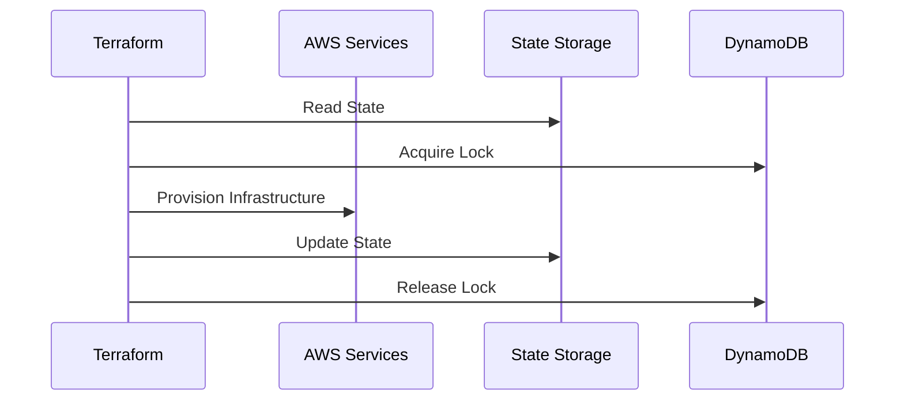
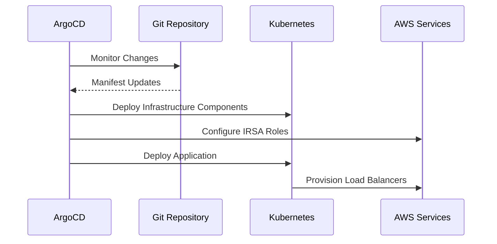

# Islamic App - Complete CI/CD Pipeline

## Overview

This repository implements a comprehensive end-to-end CI/CD pipeline for the Islamic App, combining modern DevOps practices with cloud-native technologies. The pipeline automates the entire software delivery lifecycle from code commit to production deployment using GitHub Actions, Terraform, Kubernetes, and ArgoCD.

## 🏗️ Complete Architecture Overview

<!-- TODO: Add Complete CI/CD Architecture Diagram -->




## 🚀 Pipeline Components

### 1. **Continuous Integration (CI)**
- **Source**: GitHub Repository
- **Trigger**: Code push/pull request
- **Tools**: GitHub Actions, Docker, Trivy
- **Output**: Tested and scanned container images

<!-- TODO: Add CI Pipeline Flow Screenshot -->


### 2. **Infrastructure as Code (IaC)**
- **Source**: Terraform configurations
- **Management**: Remote state in S3 with DynamoDB locking
- **Resources**: Complete EKS infrastructure on AWS
- **Output**: Production-ready Kubernetes cluster

<!-- TODO: Add Terraform Infrastructure Screenshot -->


### 3. **Continuous Deployment (CD)**
- **Source**: GitOps with ArgoCD
- **Trigger**: Kubernetes manifest changes
- **Tools**: ArgoCD, Helm, External Secrets
- **Output**: Deployed and running applications

<!-- TODO: Add ArgoCD GitOps Flow Screenshot -->


## 🔄 End-to-End Workflow

### Phase 1: Code Development & Integration



<!-- TODO: Add Development Workflow Screenshot -->


#### **1. Code Commit**
- Developer pushes code to GitHub repository
- Automated triggers activate CI pipeline
- Branch protection rules enforce code review

#### **2. Automated Testing**
- Unit tests for frontend and backend
- Integration tests for API endpoints
- Code quality and security analysis

#### **3. Container Build & Scan**
- Multi-stage Docker builds for optimization
- Trivy vulnerability scanning
- Image signing and verification

#### **4. Registry Push**
- Secure push to Amazon ECR
- Image tagging with commit SHA
- Automated cleanup of old images

#### **5. Manifest Updates**
- Automatic update of Kubernetes manifests
- GitOps commit with new image tags
- Version tracking and rollback capability

### Phase 2: Infrastructure Provisioning



<!-- TODO: Add Infrastructure Provisioning Screenshot -->


#### **1. State Management**
- Remote state stored in S3 bucket
- State locking with DynamoDB
- Cross-region state replication

#### **2. Network Infrastructure**
- Custom VPC with public/private subnets
- NAT Gateway for secure outbound access
- Security groups and NACLs

#### **3. EKS Cluster**
- Custom EKS cluster (not using modules)
- Worker node groups with auto-scaling
- OIDC provider for IRSA integration

#### **4. Supporting Services**
- Route 53 hosted zone management
- SSL certificates via Certificate Manager
- Parameter Store for secrets management

### Phase 3: Application Deployment



<!-- TODO: Add Application Deployment Screenshot -->


#### **1. ArgoCD Sync Waves**
- **Wave -1**: EBS CSI Driver for storage
- **Wave 0**: AWS Load Balancer Controller
- **Wave 2**: External DNS for domain management
- **Wave 3**: External Secrets Operator
- **Wave 4**: External Secrets manifests
- **Wave 5**: Islamic App deployment
- **Wave 6**: Ingress with SSL configuration

#### **2. Secret Management**
- External Secrets fetches from Parameter Store
- Automatic secret rotation and updates
- Secure injection into application pods

#### **3. Service Exposure**
- Load balancer provisioning
- DNS record creation via External DNS
- SSL certificate attachment

## 🛠️ Technology Stack

### **Development & CI**
- **Languages**: JavaScript/TypeScript (Frontend), Node.js/Python (Backend)
- **Testing**: Jest, Pytest, Integration Tests
- **Containerization**: Docker, Multi-stage builds
- **Security**: Trivy vulnerability scanning
- **CI/CD**: GitHub Actions

<!-- TODO: Add Technology Stack Diagram -->


### **Infrastructure & Platform**
- **Cloud Provider**: Amazon Web Services (AWS)
- **Container Orchestration**: Amazon EKS (Kubernetes)
- **Infrastructure as Code**: Terraform
- **State Management**: S3 + DynamoDB
- **DNS & SSL**: Route 53 + Certificate Manager
- **Secrets**: AWS Parameter Store + KMS

### **Deployment & GitOps**
- **GitOps Tool**: ArgoCD
- **Package Manager**: Helm
- **Service Mesh**: (Optional) Istio
- **Monitoring**: CloudWatch, Prometheus (planned)
- **Storage**: EBS CSI Driver

## 🔒 Security Implementation

### **Multi-Layer Security Approach**

<!-- TODO: Add Security Architecture Diagram -->


#### **1. Container Security**
- Vulnerability scanning with Trivy
- Distroless base images
- Non-root container execution
- Image signing and verification

#### **2. Kubernetes Security**
- RBAC (Role-Based Access Control)
- Pod Security Standards
- Network Policies
- Service Accounts with minimal permissions

#### **3. AWS Security**
- IAM Roles for Service Accounts (IRSA)
- VPC network isolation
- Security groups and NACLs
- Encryption at rest and in transit

#### **4. Secrets Management**
- External Secrets Operator
- AWS Parameter Store integration
- KMS encryption for secrets
- Secret rotation capabilities

<!-- TODO: Add Secrets Management Screenshot -->


## 📊 Monitoring & Observability

### **Monitoring Stack**

<!-- TODO: Add Monitoring Stack Diagram -->


#### **1. Infrastructure Monitoring**
- **AWS CloudWatch**: Native AWS resource monitoring
- **VPC Flow Logs**: Network traffic analysis
- **EKS Control Plane Logs**: Kubernetes API audit logs
- **Cost Monitoring**: AWS Cost Explorer integration

#### **2. Application Monitoring**
- **ArgoCD Dashboard**: Deployment status and health
- **Kubernetes Dashboard**: Cluster resource utilization
- **Application Logs**: Centralized logging with CloudWatch
- **Custom Metrics**: Business metrics via Prometheus (planned)

#### **3. Security Monitoring**
- **AWS GuardDuty**: Threat detection
- **AWS Config**: Compliance monitoring
- **Security Scanning**: Automated vulnerability assessment
- **Audit Logs**: Complete audit trail for all operations

<!-- TODO: Add Monitoring Dashboard Screenshot -->


## 🎯 Key Features & Benefits

### **Automation Benefits**
- **Zero-Touch Deployment**: Fully automated CI/CD pipeline
- **Consistent Environments**: Infrastructure as Code ensures reproducibility
- **Rapid Recovery**: GitOps enables quick rollbacks and disaster recovery
- **Security First**: Automated security scanning and compliance

<!-- TODO: Add Pipeline Benefits Diagram -->


### **Scalability Features**
- **Auto-Scaling**: Horizontal and vertical pod autoscaling
- **Cluster Scaling**: Automatic node group scaling
- **Load Balancing**: Multi-AZ load distribution
- **Storage Scaling**: Dynamic EBS volume expansion

### **Cost Optimization**
- **Spot Instances**: Cost-effective compute with spot instances
- **Resource Right-Sizing**: Automated resource optimization
- **Auto-Scaling**: Scale resources based on actual demand
- **Reserved Capacity**: Long-term cost savings through reservations

## 🚀 Getting Started

### **Prerequisites**

1. **Development Environment**
   ```bash
   # Required tools
   - Git
   - Docker
   - Node.js/npm (for frontend)
   - Python (for backend)
   - AWS CLI
   - kubectl
   - Terraform
   - Helm
   ```

2. **AWS Account Setup**
   - AWS account with appropriate permissions
   - IAM roles for Terraform and EKS
   - Route 53 hosted zone for custom domain
   - ECR repository for container images

3. **GitHub Repository**
   - Fork or clone the Islamic App repository
   - Configure GitHub Actions secrets
   - Set up branch protection rules

### **Quick Start Guide**

#### **Step 1: Infrastructure Deployment**

<!-- TODO: Add Quick Start Infrastructure Screenshot -->


```bash
# Clone the repository
git clone https://github.com/abdelrahman-shebl/Islamic-app.git
cd Islamic-app

# Navigate to Terraform directory
cd terraform/

# Initialize Terraform
terraform init

# Create workspace for environment
terraform workspace new production

# Plan infrastructure
terraform plan -var-file="environments/prod.tfvars"

# Apply infrastructure
terraform apply -var-file="environments/prod.tfvars"
```

#### **Step 2: Configure Kubernetes Access**

```bash
# Update kubeconfig
aws eks update-kubeconfig --region us-west-2 --name islamic-app-cluster

# Verify cluster access
kubectl get nodes

# Install ArgoCD
kubectl create namespace argocd
kubectl apply -n argocd -f https://raw.githubusercontent.com/argoproj/argo-cd/stable/manifests/install.yaml
```

#### **Step 3: Deploy ArgoCD Applications**

<!-- TODO: Add ArgoCD Installation Screenshot -->


```bash
# Apply ArgoCD applications
kubectl apply -f argocd-apps/

# Wait for applications to sync
kubectl get applications -n argocd

# Access ArgoCD UI
kubectl port-forward svc/argocd-server -n argocd 8080:443
```

#### **Step 4: Configure CI Pipeline**

```bash
# Set GitHub Secrets
DOCKER_USERNAME=<your-docker-username>
DOCKER_PASSWORD=<your-docker-password>
AWS_ACCESS_KEY_ID=<your-aws-access-key>
AWS_SECRET_ACCESS_KEY=<your-aws-secret-key>
KUBE_CONFIG=<base64-encoded-kubeconfig>
```

## 📁 Repository Structure

```
Islamic-app/
├── .github/
│   └── workflows/
│       ├── ci.yml                    # Main CI pipeline
│       ├── security-scan.yml         # Security scanning workflow
│       └── deploy.yml               # Deployment workflow
├── CI/
│   └── K8s/
│       ├── config-maps/             # Application configurations
│       ├── Deployments/             # Kubernetes deployments
│       ├── eso/                     # External Secrets configs
│       ├── ingress/                 # Helm chart for ingress
│       ├── secrets/                 # Secret templates
│       ├── services/                # Service definitions
│       ├── statefulsets/            # Database StatefulSets
│       └── StorageClass/            # Storage configurations
├── terraform/
│   ├── environments/
│   │   ├── dev.tfvars              # Development variables
│   │   └── prod.tfvars             # Production variables
│   ├── modules/
│   │   ├── vpc/                    # VPC module
│   │   ├── eks/                    # EKS module
│   │   ├── iam/                    # IAM roles module
│   │   └── security/               # Security groups module
│   ├── main.tf                     # Main Terraform configuration
│   ├── variables.tf                # Variable definitions
│   ├── outputs.tf                  # Output definitions
│   └── versions.tf                 # Provider versions
├── argocd-apps/
│   ├── ebs-csi.yaml               # EBS CSI driver app
│   ├── aws-load-balancer.yaml     # Load balancer controller
│   ├── external-dns.yaml          # External DNS app
│   ├── external-secrets.yaml      # External secrets app
│   ├── islamic-app.yaml           # Main application
│   └── ingress-app.yaml           # Ingress configuration
├── src/
│   ├── frontend/                   # React.js frontend
│   ├── backend/                    # API backend
│   └── database/                   # Database configurations
├── docs/
│   ├── images/                     # Documentation images
│   ├── architecture.md             # Architecture documentation
│   ├── deployment.md               # Deployment guide
│   └── troubleshooting.md          # Troubleshooting guide
├── docker/
│   ├── frontend/
│   │   └── Dockerfile              # Frontend container
│   └── backend/
│       └── Dockerfile              # Backend container
├── README.md                       # Main README
├── CI-README.md                    # CI pipeline documentation
├── CD-README.md                    # CD infrastructure documentation
└── docker-compose.yml             # Local development setup
```

## 🔧 Configuration Management

### **Environment-Specific Configurations**

<!-- TODO: Add Configuration Management Screenshot -->


#### **Development Environment**
```hcl
# environments/dev.tfvars
cluster_name = "islamic-app-dev"
environment = "development"
vpc_cidr = "10.1.0.0/16"
instance_types = ["t3.small"]
min_size = 1
max_size = 3
desired_size = 1
```

#### **Production Environment**
```hcl
# environments/prod.tfvars
cluster_name = "islamic-app-prod"
environment = "production"
vpc_cidr = "10.0.0.0/16"
instance_types = ["t3.medium", "t3.large"]
min_size = 2
max_size = 10
desired_size = 3
```

### **Application Configuration**

#### **ConfigMaps**
- **Frontend Config**: API endpoints, feature flags
- **Backend Config**: Database connections, service URLs
- **Database Config**: Initialization scripts, parameters

#### **Secrets Management**
- **Database Credentials**: Stored in Parameter Store
- **API Keys**: External service authentication
- **SSL Certificates**: Managed by Certificate Manager

## 📈 Performance & Scaling

### **Application Performance**

<!-- TODO: Add Performance Metrics Screenshot -->


#### **Frontend Optimization**
- **CDN Integration**: CloudFront for static assets
- **Code Splitting**: Lazy loading of components
- **Bundle Optimization**: Webpack optimizations
- **Progressive Web App**: Service worker implementation

#### **Backend Performance**
- **Connection Pooling**: Database connection optimization
- **Caching Strategy**: Redis integration for caching
- **API Optimization**: Response compression and pagination
- **Async Processing**: Background job processing

#### **Database Performance**
- **Read Replicas**: Horizontal scaling for read operations
- **Connection Pooling**: Efficient database connections
- **Query Optimization**: Index optimization and query tuning
- **Backup Strategy**: Automated backups and point-in-time recovery

### **Infrastructure Scaling**

#### **Horizontal Pod Autoscaler (HPA)**
```yaml
apiVersion: autoscaling/v2
kind: HorizontalPodAutoscaler
metadata:
  name: islamic-app-hpa
spec:
  scaleTargetRef:
    apiVersion: apps/v1
    kind: Deployment
    name: islamic-app-backend
  minReplicas: 2
  maxReplicas: 20
  metrics:
  - type: Resource
    resource:
      name: cpu
      target:
        type: Utilization
        averageUtilization: 70
```

#### **Cluster Autoscaler**
- **Node Group Scaling**: Automatic worker node provisioning
- **Spot Instance Integration**: Cost-effective scaling with spot instances
- **Multi-AZ Scaling**: Balanced scaling across availability zones
- **Custom Metrics**: Scaling based on application-specific metrics

## 🔍 Monitoring & Alerting

### **Comprehensive Monitoring Strategy**

<!-- TODO: Add Comprehensive Monitoring Screenshot -->


#### **Infrastructure Metrics**
- **Cluster Health**: Node status, resource utilization
- **Network Monitoring**: Latency, throughput, error rates
- **Storage Monitoring**: Disk usage, IOPS, throughput
- **Cost Monitoring**: Real-time cost tracking and alerts

#### **Application Metrics**
- **Response Times**: API endpoint performance
- **Error Rates**: Application error tracking
- **User Metrics**: Active users, session duration
- **Business Metrics**: Feature usage, conversion rates

#### **Security Monitoring**
- **Access Logs**: User authentication and authorization
- **Security Scanning**: Continuous vulnerability assessment
- **Compliance Monitoring**: Policy compliance tracking
- **Threat Detection**: Anomaly detection and alerting

### **Alerting Configuration**

#### **Critical Alerts**
- **Cluster Down**: EKS cluster unavailability
- **High Error Rates**: Application error thresholds
- **Resource Exhaustion**: CPU/Memory/Storage limits
- **Security Incidents**: Unauthorized access attempts

#### **Warning Alerts**
- **High Resource Usage**: Resource utilization thresholds
- **Slow Response Times**: Performance degradation
- **Certificate Expiry**: SSL certificate renewal reminders
- **Backup Failures**: Database backup issues

## 🛡️ Disaster Recovery & Business Continuity

### **Backup Strategy**

<!-- TODO: Add Backup Strategy Screenshot -->


#### **Data Backup**
- **Database Snapshots**: Automated daily snapshots
- **Cross-Region Replication**: Disaster recovery preparation
- **Point-in-Time Recovery**: Fine-grained recovery options
- **Backup Testing**: Regular restore testing procedures

#### **Configuration Backup**
- **GitOps Repository**: All configurations in version control
- **Terraform State**: Backed up in S3 with versioning
- **Cluster Configuration**: EKS configuration backup
- **Secret Backup**: Secure backup of sensitive configurations

### **Recovery Procedures**

#### **Application Recovery**
1. **Rollback Deployment**: ArgoCD-based rollback to previous version
2. **Database Recovery**: Point-in-time database restoration
3. **Configuration Recovery**: Git-based configuration restoration
4. **Service Recovery**: Load balancer and DNS failover

#### **Infrastructure Recovery**
1. **Multi-Region Deployment**: Secondary region activation
2. **Terraform Recovery**: Infrastructure recreation from code
3. **Data Recovery**: Cross-region data replication
4. **DNS Failover**: Automatic traffic redirection

## 🎯 Future Enhancements

### **Planned Features**

<!-- TODO: Add Future Enhancements Roadmap -->


#### **Short Term (Next 3 months)**
- **Prometheus & Grafana**: Advanced monitoring and visualization
- **Istio Service Mesh**: Enhanced service-to-service communication
- **Automated Testing**: Comprehensive end-to-end testing
- **Performance Optimization**: Advanced caching and optimization

#### **Medium Term (3-6 months)**
- **Multi-Region Deployment**: Global application distribution
- **Advanced Security**: Zero-trust security implementation
- **Machine Learning Integration**: AI-powered features
- **Mobile Application**: React Native mobile app

#### **Long Term (6+ months)**
- **Serverless Integration**: Lambda function integration
- **Edge Computing**: CloudFront edge locations
- **Advanced Analytics**: Real-time analytics platform
- **International Expansion**: Multi-language support

## 🤝 Contributing

### **Development Workflow**

<!-- TODO: Add Development Workflow Screenshot -->


1. **Fork Repository**: Create your own fork of the project
2. **Create Feature Branch**: `git checkout -b feature/your-feature-name`
3. **Make Changes**: Implement your changes with tests
4. **Run Tests Locally**: Ensure all tests pass
5. **Commit Changes**: Follow conventional commit messages
6. **Push to Fork**: Push changes to your forked repository
7. **Create Pull Request**: Submit PR with detailed description
8. **Code Review**: Address feedback from maintainers
9. **Merge**: PR merged after approval and CI passing

### **Code Standards**
- **Frontend**: ESLint, Prettier, TypeScript
- **Backend**: PEP 8 (Python), Black formatter
- **Infrastructure**: Terraform formatting and validation
- **Documentation**: Markdown with proper formatting

### **Testing Requirements**
- **Unit Tests**: Minimum 80% code coverage
- **Integration Tests**: API endpoint testing
- **Infrastructure Tests**: Terraform validation
- **Security Tests**: Vulnerability scanning

## 📚 Documentation

### **Available Documentation**

- 📖 [CI Pipeline README](./CI-README.md) - Detailed CI pipeline documentation
- 🏗️ [CD Infrastructure README](./CD-README.md) - Infrastructure and deployment guide
- 🏛️ [Architecture Documentation](./docs/architecture.md) - System architecture details
- 🚀 [Deployment Guide](./docs/deployment.md) - Step-by-step deployment instructions
- 🔧 [Troubleshooting Guide](./docs/troubleshooting.md) - Common issues and solutions
- 🔒 [Security Guidelines](./docs/security.md) - Security best practices
- 💰 [Cost Optimization](./docs/cost-optimization.md) - Cost management strategies
- 📊 [Monitoring Setup](./docs/monitoring.md) - Monitoring and alerting configuration

### **API Documentation**
- **OpenAPI Specification**: Complete API documentation
- **Postman Collection**: Ready-to-use API testing collection
- **Authentication Guide**: API authentication methods
- **Rate Limiting**: API usage limits and throttling

## ❓ FAQ

### **Common Questions**

**Q: How long does the complete deployment take?**
A: Initial infrastructure deployment takes 15-20 minutes, application deployment takes 5-10 minutes.

**Q: Can I deploy to different AWS regions?**
A: Yes, update the region variables in Terraform configuration and redeploy.

**Q: How do I scale the application?**
A: HPA automatically scales based on CPU/memory. You can also manually scale deployments.

**Q: What happens if ArgoCD fails?**
A: Applications continue running. ArgoCD can be restored, and it will sync the desired state.

**Q: How are secrets rotated?**
A: External Secrets Operator can automatically rotate secrets from Parameter Store.

## 📞 Support

### **Getting Help**

- 🐛 **Bug Reports**: [GitHub Issues](https://github.com/abdelrahman-shebl/Islamic-app/issues)
- 💡 **Feature Requests**: [GitHub Discussions](https://github.com/abdelrahman-shebl/Islamic-app/discussions)
- 📧 **Email Support**: support@shebl22.me
- 💬 **Community Chat**: [Slack Channel](https://islamic-app.slack.com)

### **SLA & Support Levels**

- **Community Support**: Best effort, GitHub issues
- **Email Support**: Response within 48 hours
- **Priority Support**: Available for enterprise users
- **24/7 Support**: Available for critical production issues

## 📄 License

This project is licensed under the MIT License - see the [LICENSE](LICENSE) file for details.

### **Third-Party Licenses**
- **Terraform**: Mozilla Public License 2.0
- **Kubernetes**: Apache License 2.0
- **ArgoCD**: Apache License 2.0
- **Docker**: Apache License 2.0

---

## 🎉 Acknowledgments

Special thanks to:
- **Kubernetes Community** for the amazing container orchestration platform
- **ArgoCD Team** for the excellent GitOps implementation
- **Terraform Team** for Infrastructure as Code capabilities
- **AWS** for providing reliable cloud infrastructure
- **Open Source Contributors** for the various tools and libraries used

---

*For detailed information about specific components, please refer to the individual README files for CI and CD pipelines.*