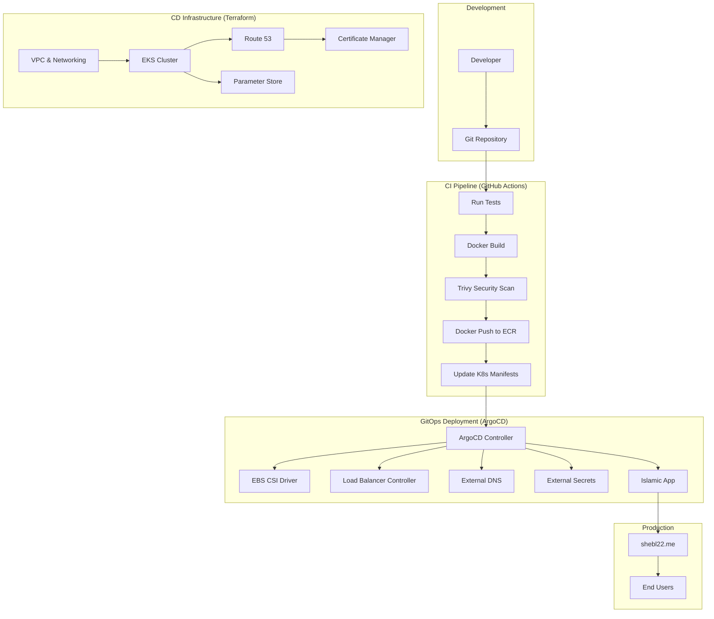
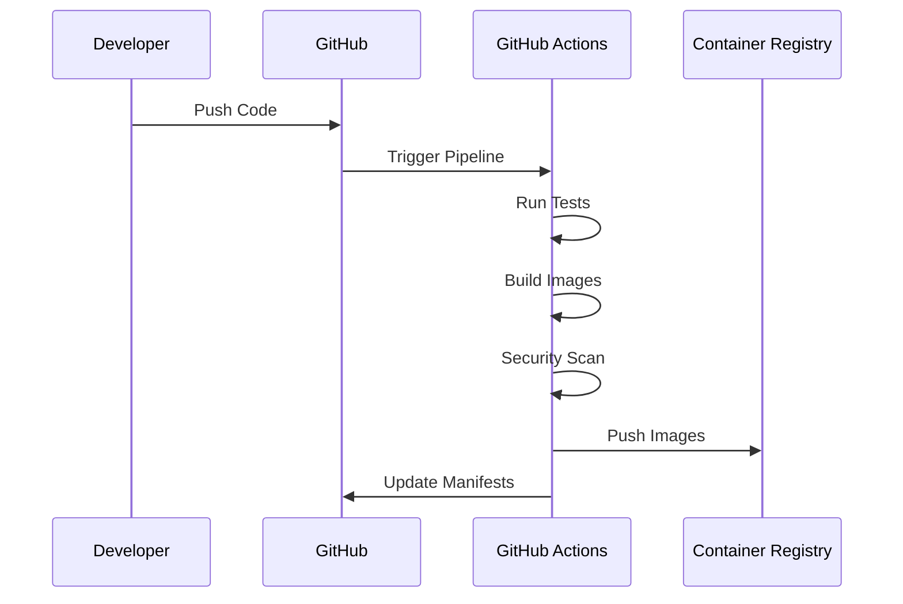
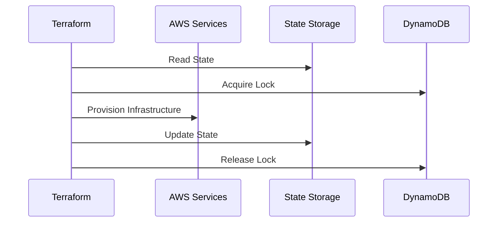
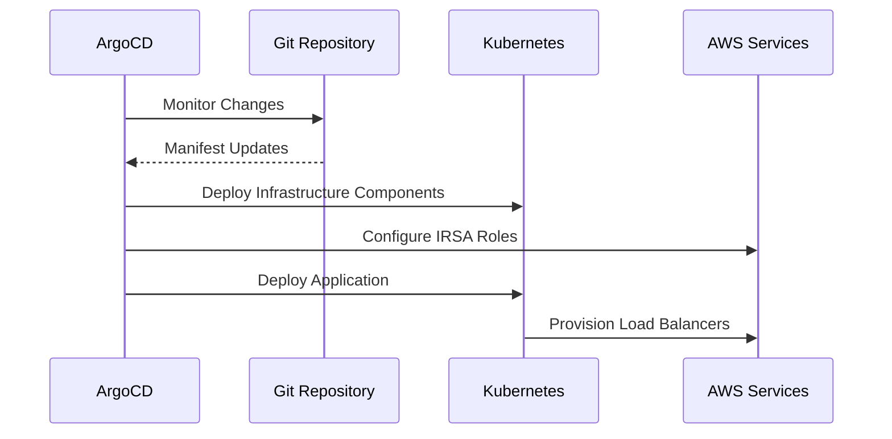

# Islamic App - Complete CI/CD Pipeline

## Overview

This repository implements a comprehensive end-to-end CI/CD pipeline for the Islamic App, combining modern DevOps practices with cloud-native technologies. The pipeline automates the entire software delivery lifecycle from code commit to production deployment using GitHub Actions, Terraform, Kubernetes, and ArgoCD.

## 🏗️ Complete Architecture Overview

<!-- TODO: Add Complete CI/CD Architecture Diagram -->

## 🚀 Pipeline Components

### 1. **Continuous Integration (CI)**
- **Source**: GitHub Repository
- **Trigger**: Code push/pull request
- **Tools**: GitHub Actions, Docker, Trivy
- **Output**: Tested and scanned container images

### 2. **Infrastructure as Code (IaC)**
- **Source**: Terraform configurations
- **Management**: Remote state in S3 with DynamoDB locking
- **Resources**: Complete EKS infrastructure on AWS
- **Output**: Production-ready Kubernetes cluster

### 3. **Continuous Deployment (CD)**
- **Source**: GitOps with ArgoCD
- **Trigger**: Kubernetes manifest changes
- **Tools**: ArgoCD, Helm, External Secrets
- **Output**: Deployed and running applications

## 🔄 End-to-End Workflow

### Phase 1: Code Development & Integration

#### **1. Code Commit**
- Developer pushes code to GitHub repository
- Automated triggers activate CI pipeline
- Branch protection rules enforce code review

#### **2. Automated Testing**
- Unit tests for frontend and backend
- Integration tests for API endpoints
- Code quality and security analysis

#### **3. Container Build & Scan**
- Multi-stage Docker builds for optimization
- Trivy vulnerability scanning
- Image signing and verification

#### **4. Registry Push**
- Secure push to Amazon ECR
- Image tagging with commit SHA
- Automated cleanup of old images

#### **5. Manifest Updates**
- Automatic update of Kubernetes manifests
- GitOps commit with new image tags
- Version tracking and rollback capability

### Phase 2: Infrastructure Provisioning

#### **1. State Management**
- Remote state stored in S3 bucket
- State locking with DynamoDB
- Cross-region state replication

#### **2. Network Infrastructure**
- Custom VPC with public/private subnets
- NAT Gateway for secure outbound access
- Security groups and NACLs

#### **3. EKS Cluster**
- Custom EKS cluster (not using modules)
- Worker node groups with auto-scaling
- OIDC provider for IRSA integration

#### **4. Supporting Services**
- Route 53 hosted zone management
- SSL certificates via Certificate Manager
- Parameter Store for secrets management

### Phase 3: Application Deployment

---

*For detailed information about specific components, please refer to the individual README files for CI and CD pipelines.*